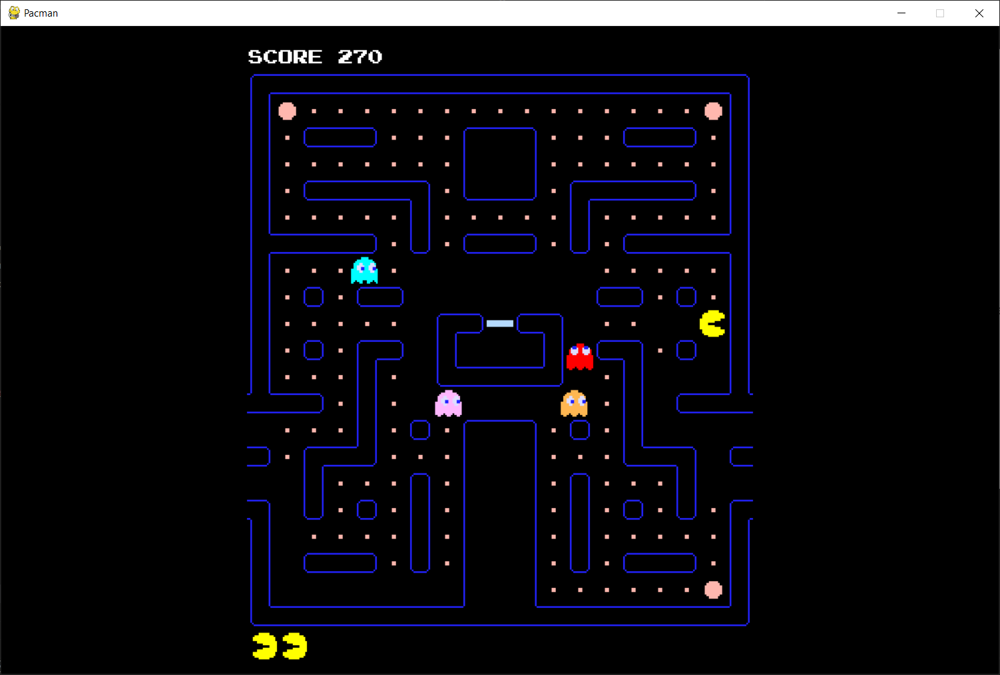

# Pacman

khourta Sofiane
el moussaoui Adel
andre Mathis



## Jeu Pacman

Le jeu est développé en Python avec la librairie pygame

dépendances nécessaires :

- python
- pygame

installation de pygame :

```pip install pygame```

Les codes du jeu se trouvent ensuite dans le répertoire src/game/

Exécution du jeu depuis src/game/ :

```python3 main.py```
ou
```python main.py```

lien du web-service :
https://pacmaz-s1-o.onrender.com

On peut préciser ces paramètres dans la génération du labyrinthe lors de la requète,
si non précisés, elles auront les valeurs de base mises entre parenthèses :
- height
- width
- nb_cycles
- num_tunnels_wrap
- num_tunnels_centre

Il faut rajouter un '?' après le lien, et séparer les paramètres avec des '&'.
Exemple :
```curl https://pacmaz-s1-o.onrender.com/generate?height=23&width=40&nb_cycles=5```
